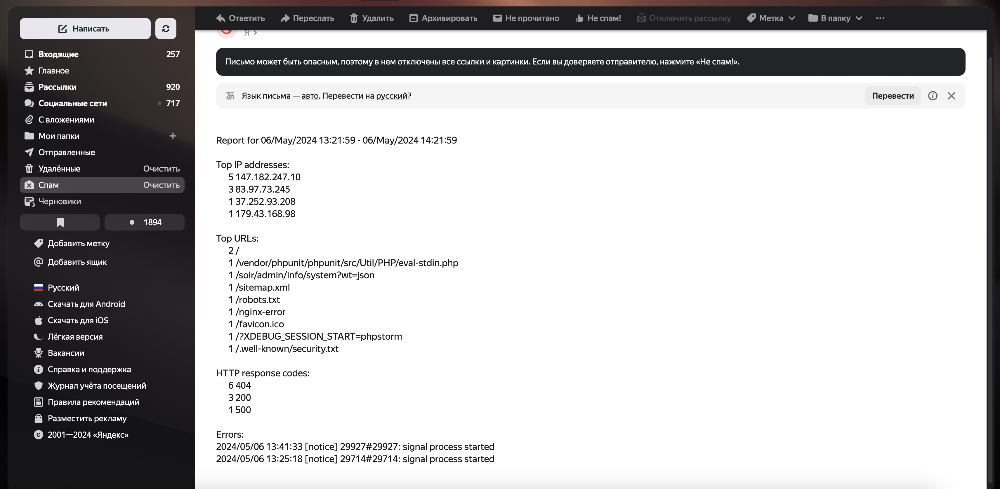

# Домашнее задание - работа с bash

## Подготовительные действия
* Работы производились на виртуальной мащине с Ubuntu 22.04, для этого нужно было установить утилиты для отправки писем и веб-сервер nginx
``` bash
root@otus:~# apt update

root@otus:~# apt install mailutils
В открывшемся окне настройки конфигурации выбираем настройки по умолчанию

root@otus:~# apt install nginx
```

## Скрипт отправки информации о запросах веб-сервера
* Данный скрипт отправляет письмо на указанную почту и содержит следующую информацию:
  * Список IP адресов (с наибольшим кол-вом запросов) с указанием кол-ва запросов c момента последнего запуска скрипта;
  * Список запрашиваемых URL (с наибольшим кол-вом запросов) с указанием кол-ва запросов c момента последнего запуска скрипта;
  * Ошибки веб-сервера/приложения c момента последнего запуска;
  * Список всех кодов HTTP ответа с указанием их кол-ва с момента последнего запуска скрипта.
* Скрипт предотвращает одновременный запуск нескольких копий до его завершения.
* Для списков с наибольшим количеством запросов установлено ограничение до 10 уникальный строк
* Запускается в CRON каждый час, поэтому чтобы выполнить условие "c момента последнего запуска скрипта" достаточно сравнить время логов со временем на час назад
``` bash
0 * * * * ./send_mail.sh
```
* Чтобы проверить отправку ошибок достаточно перезагрузить nginx
``` bash
root@otus:~# nginx -s reload
```
* На Google почту отправить письмо не удалось, потому что Google требует дополнительную авторизацию, отправка корректно отработала на почту yandex
* 