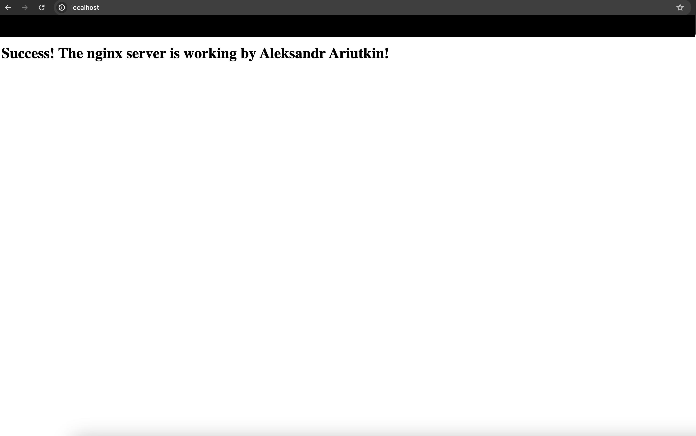

# Домашнее задание - Docker

## Основные работы
* Написан Dockerfile на основе alpine, который использует свой конфиг `nginx` и кастомную страницу
* Чтобы собрать образ необходимо запустить команду `docker build` (используется контекст для папки homework_docker, если вдруг уже в ней находитесь, то досаточно собрать с одной точкой):
``` bash
docker build -t nginx homework_docker/.
```

* После сборки запустить контейнер c именем nginx можно следующим образом:
``` bash
docker run -d -p 80:80 --name nginx nginx
```

* Проверить можно перейдя по URL в браузере - `localhost`:


* Также можно скачать образ из `dockerhub` и запустить, увидев кастомную страницу на `localhost`:
``` bash
docker pull aryutkin/nginx:latest

docker run -d -p 80:80 --name nginx aryutkin/nginx:latest
```

## Вопросы и ответы
* Определение разницы между контейнером и образом:
Образ - это абстракция, которая записана в виде файла и содержит определенные инструкции в виде слоев
Контейнер - это абстракция, которая запускает образ и дает конечный результат описанных инструкций. Контейнер работает как процесс и использует ресурсы хостовой системы, на которой запущен
* Можно ли в контейнере собрать ядро?
Чисто технически, предполагаю, что можно собрать нужные файлы ядра, хотя не пробовал. Однако смысла в этом никакого не будет, потому что контейнер не сможет использовать эти файлы, так как он использует ядро хостовой системы
