# Домашнее задание - Работа с загрузчиком

## Подготовительные действия

* Для работ используется GUI VirtualBox с образом серверной Ubuntu 24.04

## Основные работы

### Включение отображения меню Grub
* По умолчанию меню загрузчика Grub скрыто и нет задержки при загрузке. Для отображения меню нужно отредактировать конфигурационный файл:
``` bash
root@ubuntu-otus:~# nano /etc/default/grub
```

Комментируем строку, скрывающую меню и ставим задержку для выбора пункта меню в 10 секунд.
``` bash
#GRUB_TIMEOUT_STYLE=hidden
GRUB_TIMEOUT=10
```
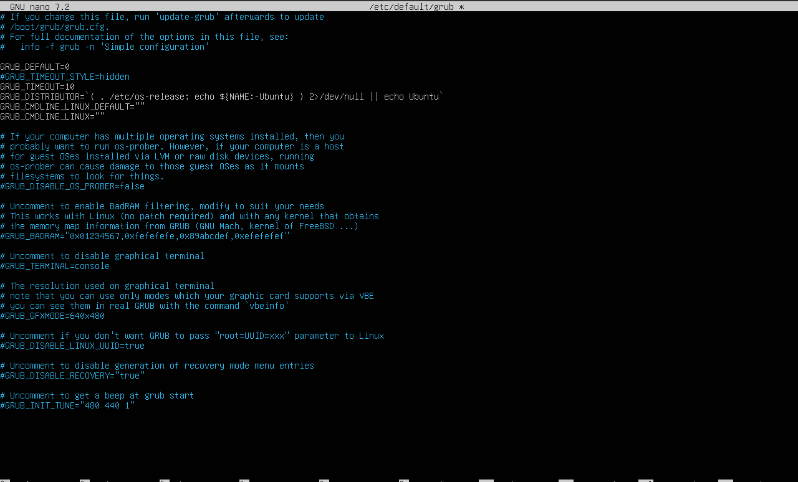

* Обновляем конфигурацию загрузчика и перезагружаемся для проверки:
``` bash
root@ubuntu-otus:~# update-grub
root@ubuntu-otus:~# reboot
```
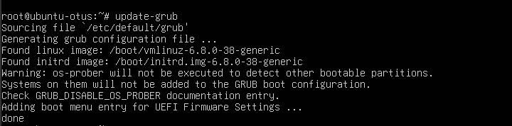

* При загрузке в окне виртуальной машины видим меню загрузчика в течение 10 секунд.
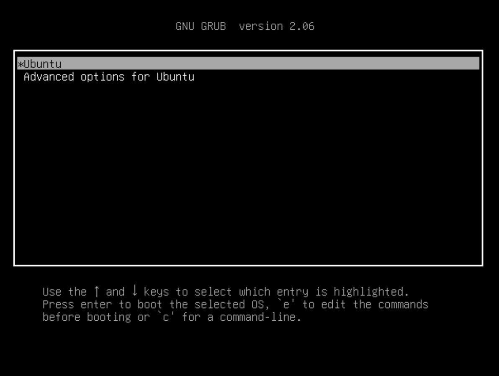

### Попасть в систему без пароля несколькими способами
#### Первый способ - init=/bin/bash
* В меню загрузчика, что на предыдущем изображении, необходимо нажать кнопку e - в данном контексте edit. Попадаем в окно, где мы можем изменить параметры загрузки. В конце строки, начинающейся с linux, добавляем init=/bin/bash и нажимаем сtrl-x для загрузки в систему:
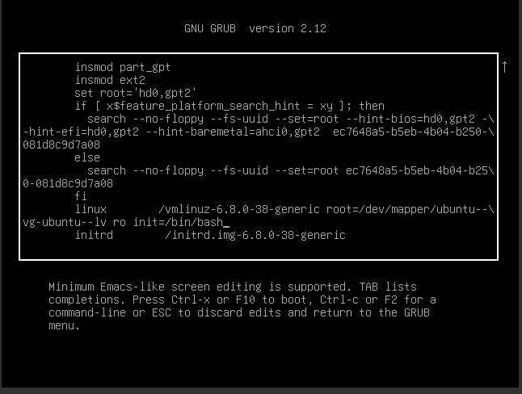
* После загрузки попадаем в систему.
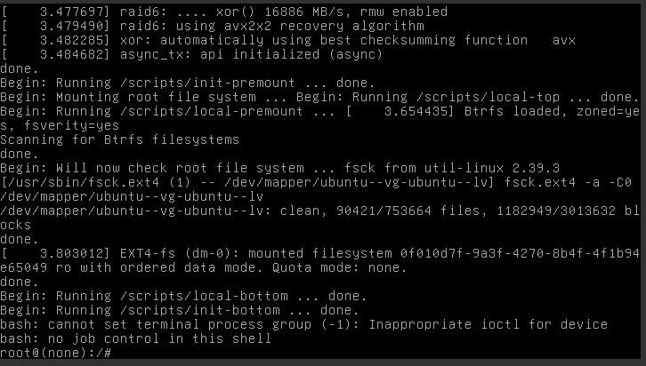
* Но есть один нюанс. Рутовая файловая система при этом монтируется в режиме Read-Only. Если вы хотите перемонтировать ее в режим Read-Write, можно воспользоваться командой:
``` bash
root@ubuntu-otus:~# mount -o remount,rw /
```
* При попытке грепнуть mount по root ничего не отобразилось, однако удалось создать файл и записать в него данные
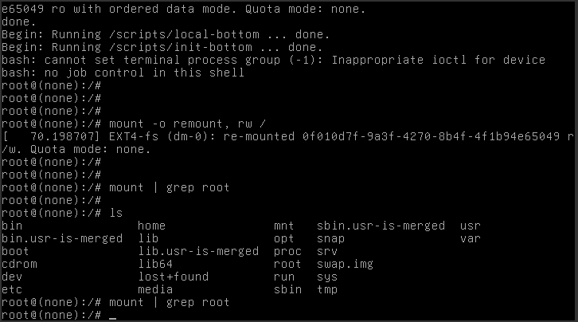
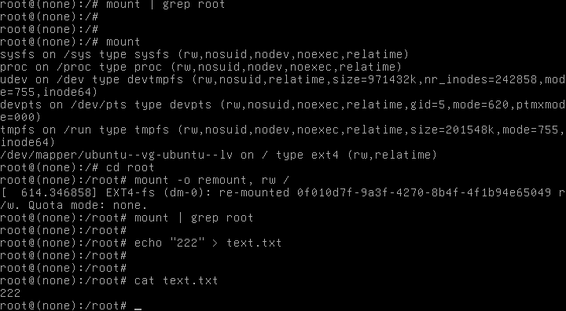

#### Второй способ - Recovery mode
* В меню загрузчика на первом уровне выбрать второй пункт (Advanced options…), далее загрузить пункт меню с указанием recovery mode в названии. Получим меню режима восстановления:
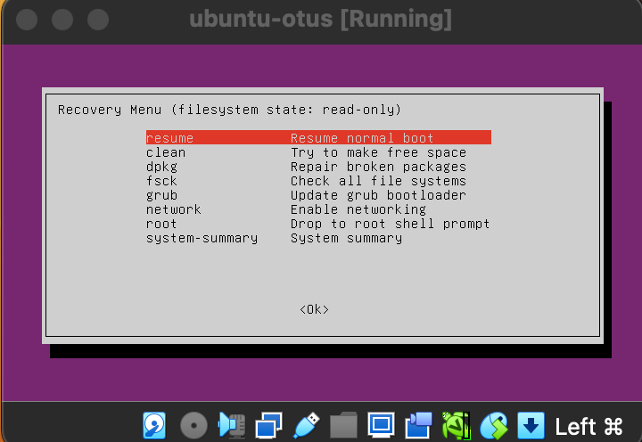
* В этом меню сначала включаем поддержку сети (network) для того, чтобы файловая система перемонтировалась в режим read/write:
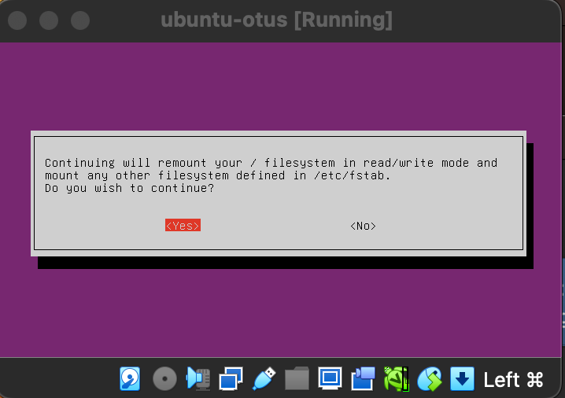
* Далее выбираем пункт root и попадаем в консоль с пользователем root:
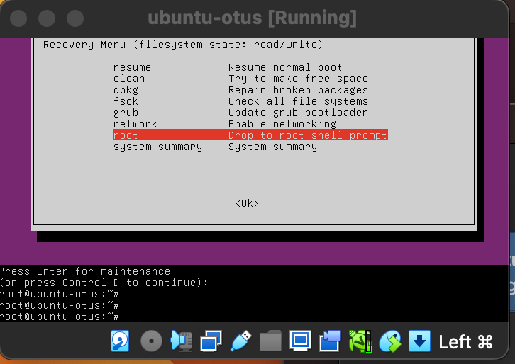
В этой консоли можно производить любые манипуляции с системой.

### Установить систему с LVM, после чего переименовать VG
* Мы установили систему Ubuntu 24.04 со стандартной разбивкой диска с использованием  LVM. Первым делом посмотрим текущее состояние системы (список Volume Group):
``` bash
root@ubuntu-otus: vgs
```

* Нас интересует вторая строка с именем Volume Group. Приступим к переименованию:
``` bash
root@ubuntu-otus: vgrename ubuntu-vg ubuntu-otus
```
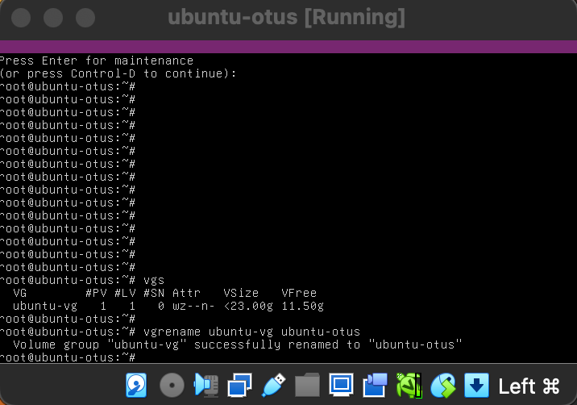

* Далее правим /boot/grub/grub.cfg. Везде заменяем старое название VG на новое (в файле дефис меняется на два дефиса ubuntu--vg ubuntu--otus). После чего можем перезагружаться и проверяем:
``` bash
root@ubuntu-otus: vgs
```
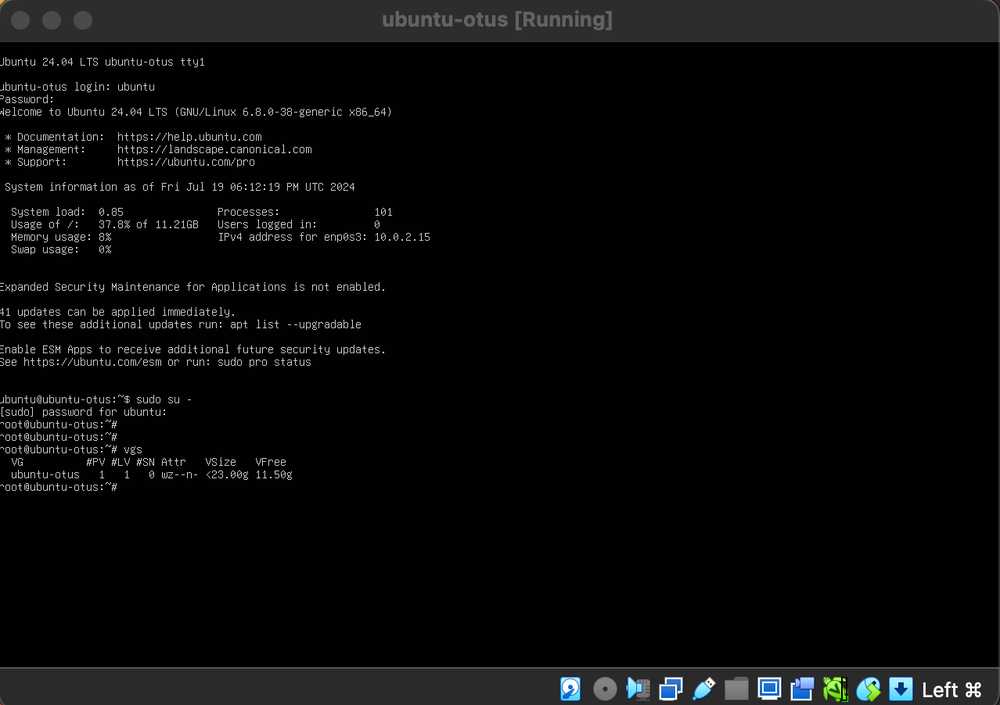
Видим, что наименование изменилось на нужное.
