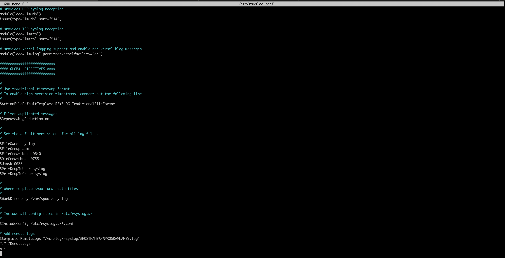
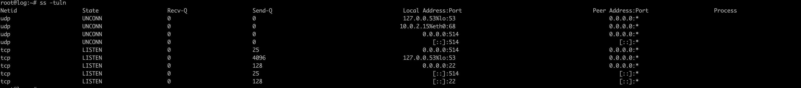
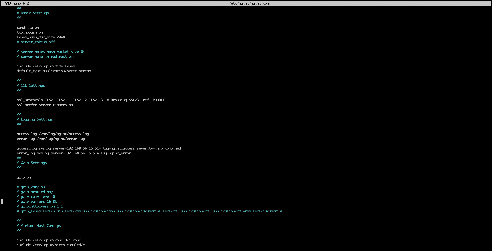
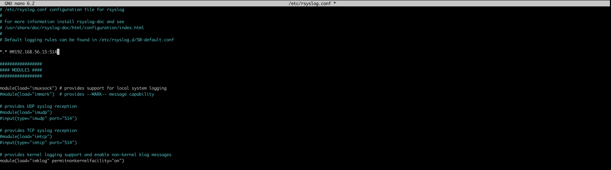

# Домашнее задание - Настраиваем центральный сервер для сбора логов

## Подготовительные действия

* Создаем виртуальные машины на основе приложенного `Vagrantfile.two` с помощью команды:
``` bash
root@[some_vm]:/src# vagrant up
```

## Основные работы
* Заходим на web-сервер и переходим в root:
``` bash
root@[some_vm]:/src# vagrant ssh web
vagrant@web:~$ sudo -i
```

* Проверяем настройки времени:
``` bash
root@web:~# timedatectl
               Local time: Fri 2024-07-26 17:04:20 UTC
           Universal time: Fri 2024-07-26 17:04:20 UTC
                 RTC time: Fri 2024-07-26 17:04:19
                Time zone: Etc/UTC (UTC, +0000)
System clock synchronized: no
              NTP service: inactive
          RTC in local TZ: no

root@web:~# date
Fri Jul 26 05:04:27 PM UTC 2024
```

* Устанавливаем nginx:
``` bash
root@web:~# apt update && apt install -y nginx
```

* Проверим, что nginx работает корректно:
``` bash
root@web:~# systemctl status nginx
● nginx.service - A high performance web server and a reverse proxy server
     Loaded: loaded (/lib/systemd/system/nginx.service; enabled; vendor preset: enabled)
     Active: active (running) since Fri 2024-07-26 17:08:54 UTC; 40s ago
       Docs: man:nginx(8)
    Process: 3791 ExecStartPre=/usr/sbin/nginx -t -q -g daemon on; master_process on; (code=exited, status=0/SUCCESS)
    Process: 3792 ExecStart=/usr/sbin/nginx -g daemon on; master_process on; (code=exited, status=0/SUCCESS)
   Main PID: 3883 (nginx)
      Tasks: 3 (limit: 1641)
     Memory: 4.7M
        CPU: 91ms
     CGroup: /system.slice/nginx.service
             ├─3883 "nginx: master process /usr/sbin/nginx -g daemon on; master_process on;"
             ├─3886 "nginx: worker process" "" "" "" "" "" "" "" "" "" "" "" "" "" "" "" "" "" "" "" "" "" "" "" "" "" "" ""
             └─3887 "nginx: worker process" "" "" "" "" "" "" "" "" "" "" "" "" "" "" "" "" "" "" "" "" "" "" "" "" "" "" ""

Jul 26 17:08:54 web systemd[1]: Starting A high performance web server and a reverse proxy server...
Jul 26 17:08:54 web systemd[1]: Started A high performance web server and a reverse proxy server.
```
Так как vagrant запускает на отдельной виртуальной машине, то из браузера сложнее проверить, поэтому дополнительно можно проверить через curl
``` bash
root@web:~# curl -I http://192.168.56.10
HTTP/1.1 200 OK
Server: nginx/1.18.0 (Ubuntu)
Date: Fri, 26 Jul 2024 17:09:55 GMT
Content-Type: text/html
Content-Length: 612
Last-Modified: Fri, 26 Jul 2024 17:08:51 GMT
Connection: keep-alive
ETag: "66a3d823-264"
Accept-Ranges: bytes
```

* Откроем еще одно окно терминала и подключаемся по ssh к ВМ log и переходим в root:
``` bash
root@[some_vm]:/src# vagrant ssh log
vagrant@log:~$ sudo -i
```

* Также проверим настройки времени и убедимся, что они соответствуют машине web:
``` bash
root@log:~# timedatectl
               Local time: Fri 2024-07-26 17:07:38 UTC
           Universal time: Fri 2024-07-26 17:07:38 UTC
                 RTC time: Fri 2024-07-26 17:07:38
                Time zone: Etc/UTC (UTC, +0000)
System clock synchronized: no
              NTP service: inactive
          RTC in local TZ: no
root@log:~# date
Fri Jul 26 05:07:46 PM UTC 2024
```

* `rsyslog` должен быть установлен по умолчанию в нашей ОС, проверим это:
``` bash
root@log:~# apt list rsyslog
Listing... Done
rsyslog/jammy-updates,jammy-security,now 8.2112.0-2ubuntu2.2 amd64 [installed,automatic]
```

* Изменяем настройки конфигурции таким образом, чтобы открыть 514 порт (TCP и UDP):
``` bash
root@log:~# nano /etc/rsyslog.conf
```
Находим закоментированные строчки
``` bash
# provides UDP syslog reception
#module(load="imudp")
#input(type="imudp" port="514")

# provides TCP syslog reception
#module(load="imtcp")
#input(type="imtcp" port="514")
```
И проводим к следующему виду:
``` bash
# provides UDP syslog reception
module(load="imudp")
input(type="imudp" port="514")

# provides TCP syslog reception
module(load="imtcp")
input(type="imtcp" port="514")
```
Также в конец файла добавляем правила приёма сообщений от хостов:
``` bash
# Add remote logs
$template RemoteLogs,"/var/log/rsyslog/%HOSTNAME%/%PROGRAMNAME%.log"
*.* ?RemoteLogs
& ~
```
Данные параметры будут отправлять в папку `/var/log/rsyslog` логи, которые будут приходить от других серверов. Например, Access-логи nginx от сервера web, будут идти в файл `/var/log/rsyslog/web/nginx_access.log`

* Далее сохраняем файл и перезапускаем службу `rsyslog`:
``` bash
root@log:~# systemctl restart rsyslog
```

* Если ошибок не допущено, то у нас будут видны открытые порты TCP,UDP 514:
``` bash
root@log:~# ss -tuln
```

* Далее настроим отправку логов с web-сервера, переходим обратно на вкладку с ним и проверяем версию nginx:
``` bash
root@web:~# nginx -v
nginx version: nginx/1.18.0 (Ubuntu)
```
Версия nginx должна быть 1.7 или выше. В нашем примере используется версия nginx 1.18.

* Правим файл `/etc/nginx/nginx.conf`:
``` bash
root@web:~# nano /etc/nginx/nginx.conf
```
Находим раздел с логами и приводим их к следующему виду:
``` bash
        access_log /var/log/nginx/access.log;
        error_log /var/log/nginx/error.log;

        access_log syslog:server=192.168.56.15:514,tag=nginx_access,severity=info combined;
        error_log syslog:server=192.168.56.15:514,tag=nginx_error;
```
Для Access-логов указываем удаленный сервер и уровень логов, которые нужно отправлять. Для error_log добавляем удаленный сервер. Если требуется чтобы логи хранились локально и отправлялись на удаленный сервер, требуется указать 2 строки.  
Tag нужен для того, чтобы логи записывались в разные файлы.  
По умолчанию, error-логи отправляют логи, которые имеют severity: error, crit, alert и emerg. Если требуется хранить или пересылать логи с другим severity, то это также можно указать в настройках nginx.  


* Проверяем конфигурацию и перезагружаем nginx:
``` bash
root@web:~# nginx -t
nginx: the configuration file /etc/nginx/nginx.conf syntax is ok
nginx: configuration file /etc/nginx/nginx.conf test is successful
root@web:~# systemctl restart nginx
```

* Вызываем несколько раз страницу nginx:
``` bash
root@web:~# curl -I http://192.168.56.10
HTTP/1.1 200 OK
Server: nginx/1.18.0 (Ubuntu)
Date: Fri, 26 Jul 2024 17:29:43 GMT
Content-Type: text/html
Content-Length: 612
Last-Modified: Fri, 26 Jul 2024 17:08:51 GMT
Connection: keep-alive
ETag: "66a3d823-264"
Accept-Ranges: bytes
```

* Далее заходим на log-сервер и смотрим информацию об nginx:
``` bash
root@log:~# cat /var/log/rsyslog/web/nginx_access.log
Jul 26 17:29:43 web nginx_access: 192.168.56.10 - - [26/Jul/2024:17:29:43 +0000] "HEAD / HTTP/1.1" 200 0 "-" "curl/7.81.0"
Jul 26 17:29:45 web nginx_access: 192.168.56.10 - - [26/Jul/2024:17:29:45 +0000] "HEAD / HTTP/1.1" 200 0 "-" "curl/7.81.0"
Jul 26 17:29:45 web nginx_access: 192.168.56.10 - - [26/Jul/2024:17:29:45 +0000] "HEAD / HTTP/1.1" 200 0 "-" "curl/7.81.0"
Jul 26 17:29:46 web nginx_access: 192.168.56.10 - - [26/Jul/2024:17:29:46 +0000] "HEAD / HTTP/1.1" 200 0 "-" "curl/7.81.0"
root@log:~# cat /var/log/rsyslog/web/nginx_error.log
cat: /var/log/rsyslog/web/nginx_error.log: No such file or directory
```
Поскольку наше приложение работает без ошибок, файл `nginx_error.log` не будет создан. Чтобы сгенерировать ошибку, можно переместить файл веб-страницы, который открывает nginx:
``` bash
root@web:~# mv /var/www/html/index.nginx-debian.html /var/www/
```
Снова вызываем страницу на web и уже видим 403 ошибку:
``` bash
root@web:~# curl -I http://192.168.56.10
HTTP/1.1 403 Forbidden
Server: nginx/1.18.0 (Ubuntu)
Date: Fri, 26 Jul 2024 17:31:08 GMT
Content-Type: text/html
Content-Length: 162
Connection: keep-alive
```
Проверяем error логи:
``` bash
root@log:~# cat /var/log/rsyslog/web/nginx_error.log
Jul 26 17:31:08 web nginx_error: 2024/07/26 17:31:08 [error] 4018#4018: *5 directory index of "/var/www/html/" is forbidden, client: 192.168.56.10, server: _, request: "HEAD / HTTP/1.1", host: "192.168.56.10"
```
Видим, что логи отправляются корректно.

* Добавляем третью виртуальную в Vagrantfile и запускаем ее (в итоге получается конфигурация из файла `Vagrantfile.three`)
``` bash
root@[some_vm]:/src# vagrant up sender
```

* Заходим на ВМ sender после ее создания и переходим в root:
``` bash
root@[some_vm]:/src# vagrant ssh sender
vagrant@sender:~$ sudo -i
```

* Меняем конфигурацию `/etc/rsyslog.conf`:
``` bash
root@sender:~# nano /etc/rsyslog.conf
```
Добавляя строку в конфиг:
``` bash
*.* @@192.168.56.15:514
```

Перезагружаем `rsyslog`
``` bash
root@sender:~# systemctl restart rsyslog
```
* Возвращаемся на ВМ log и проверяем, что туда приходят логи с ВМ sender
``` bash
root@log:~# ls /var/log/rsyslog/sender/
dbus-daemon.log  rsyslogd.log  systemd.log

root@log:~# tail -n 10 /var/log/rsyslog/sender/systemd.log
Sep 16 05:32:19 sender systemd[1]: Stopping System Logging Service...
Sep 16 05:32:19 sender systemd[1]: rsyslog.service: Deactivated successfully.
Sep 16 05:32:19 sender systemd[1]: Stopped System Logging Service.
Sep 16 05:32:19 sender systemd[1]: Starting System Logging Service...
Sep 16 05:32:19 sender systemd[1]: Started System Logging Service.
Sep 16 05:33:34 sender systemd[1]: Starting Time & Date Service...
Sep 16 05:33:34 sender systemd[1]: Started Time & Date Service.
Sep 16 05:34:04 sender systemd[1]: systemd-timedated.service: Deactivated successfully.
```
Видим, что с третьей виртуальной машины также приходят логи.

* Далее автоматизированную настройку отправки логов можно посмотреть, развернув ВМ из файла `Vagrantfile.ansible`. Только нужно сначала создать директорию `ansible` и положить туда файлы `hosts` и `provision.yml` с соответствующим содержимым из данного репозитория.
``` bash
root@[some_vm]:/src# vagrant up
```
