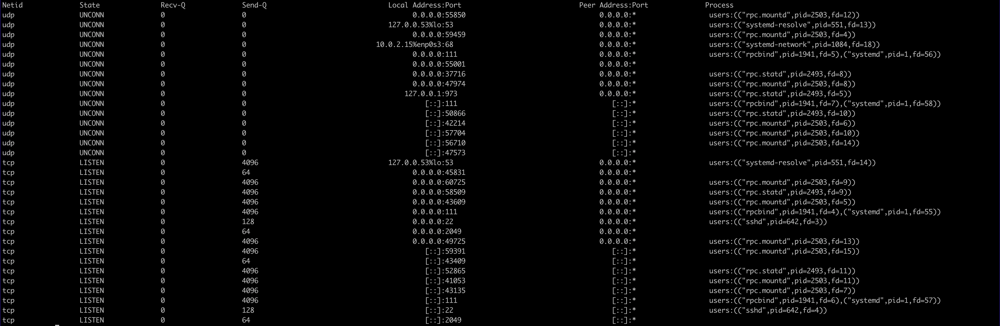

# Домашнее задание - Vagrant стенд для NFS

## Подготовительные действия
* Для корректной синхронизации директории хоста и директории /vagrant создана новая директория /src на виртуальной машине, куда помещен Vagrantfile. Также добавлена секция синхронизации директорий в него:
``` bash
    config.vm.synced_folder "/src/", "/vagrant"
```

* На основе написанного Vagrantfile сделан `vagrant up` из директории /src. Для ручных действий войти на ВМ через `vagrant ssh`

## Настраиваем сервер NFS
* Заходим на сервер:
``` bash
root@[some_vm]:/src# vagrant ssh nfss
```
Дальнейшие действия выполняются от имени пользователя имеющего повышенные привилегии, разрешающие описанные действия.

* Установим сервер NFS:
``` bash
root@nfss:~# apt install nfs-kernel-server
...
Creating config file /etc/idmapd.conf with new version

Creating config file /etc/nfs.conf with new version
Adding system user `statd' (UID 114) ...
Adding new user `statd' (UID 114) with group `nogroup' ...
Not creating home directory `/var/lib/nfs'.
Created symlink /etc/systemd/system/multi-user.target.wants/nfs-client.target → /lib/systemd/system/nfs-client.target.
Created symlink /etc/systemd/system/remote-fs.target.wants/nfs-client.target → /lib/systemd/system/nfs-client.target.
auth-rpcgss-module.service is a disabled or a static unit, not starting it.
nfs-idmapd.service is a disabled or a static unit, not starting it.
nfs-utils.service is a disabled or a static unit, not starting it.
proc-fs-nfsd.mount is a disabled or a static unit, not starting it.
rpc-gssd.service is a disabled or a static unit, not starting it.
rpc-statd-notify.service is a disabled or a static unit, not starting it.
rpc-statd.service is a disabled or a static unit, not starting it.
rpc-svcgssd.service is a disabled or a static unit, not starting it.
rpc_pipefs.target is a disabled or a static unit, not starting it.
var-lib-nfs-rpc_pipefs.mount is a disabled or a static unit, not starting it.
Setting up nfs-kernel-server (1:2.6.1-1ubuntu1.2) ...
Created symlink /etc/systemd/system/nfs-client.target.wants/nfs-blkmap.service → /lib/systemd/system/nfs-blkmap.service.
Created symlink /etc/systemd/system/multi-user.target.wants/nfs-server.service → /lib/systemd/system/nfs-server.service.
nfs-mountd.service is a disabled or a static unit, not starting it.
nfsdcld.service is a disabled or a static unit, not starting it.

Creating config file /etc/exports with new version

Creating config file /etc/default/nfs-kernel-server with new version
```

* Проверяем наличие слушающих портов 2049/udp, 2049/tcp, 111/udp, 111/tcp:
``` bash
root@nfss:~# ss -tnplu
```


* Создаём и настраиваем директорию, которая будет экспортирована в будущем:
``` bash
root@nfss:~# mkdir -p /srv/share/upload
root@nfss:~# chown -R nobody:nogroup /srv/share
root@nfss:~# chmod 0777 /srv/share/upload
```

* Cоздаём в файле /etc/exports структуру, которая позволит экспортировать ранее созданную директорию:
``` bash
root@nfss:~# cat << EOF > /etc/exports 
/srv/share 192.168.11.151/32(rw,sync,root_squash)
EOF
```

* Экспортируем ранее созданную директорию:
``` bash
root@nfss:~# exportfs -r
exportfs: /etc/exports [1]: Neither 'subtree_check' or 'no_subtree_check' specified for export "192.168.11.151/32:/srv/share".
  Assuming default behaviour ('no_subtree_check').
  NOTE: this default has changed since nfs-utils version 1.0.x
```

* Проверяем экспортированную директорию следующей командой
``` bash
root@nfss:~# exportfs -s
/srv/share  192.168.11.151/32(sync,wdelay,hide,no_subtree_check,sec=sys,rw,secure,root_squash,no_all_squash)
```

## Настраиваем клиент NFS
* Заходим на ВМ клиента:
``` bash
root@[some_vm]:/src# vagrant ssh nfsc
```
Дальнейшие действия выполняются от имени пользователя имеющего повышенные привилегии, разрешающие описанные действия.

* Установим пакет с NFS-клиентом
``` bash
root@nfsc:~# apt install nfs-common
...
Creating config file /etc/idmapd.conf with new version

Creating config file /etc/nfs.conf with new version
Adding system user `statd' (UID 114) ...
Adding new user `statd' (UID 114) with group `nogroup' ...
Not creating home directory `/var/lib/nfs'.
Created symlink /etc/systemd/system/multi-user.target.wants/nfs-client.target → /lib/systemd/system/nfs-client.target.
Created symlink /etc/systemd/system/remote-fs.target.wants/nfs-client.target → /lib/systemd/system/nfs-client.target.
auth-rpcgss-module.service is a disabled or a static unit, not starting it.
nfs-idmapd.service is a disabled or a static unit, not starting it.
nfs-utils.service is a disabled or a static unit, not starting it.
proc-fs-nfsd.mount is a disabled or a static unit, not starting it.
rpc-gssd.service is a disabled or a static unit, not starting it.
rpc-statd-notify.service is a disabled or a static unit, not starting it.
rpc-statd.service is a disabled or a static unit, not starting it.
rpc-svcgssd.service is a disabled or a static unit, not starting it.
rpc_pipefs.target is a disabled or a static unit, not starting it.
var-lib-nfs-rpc_pipefs.mount is a disabled or a static unit, not starting it.
```

* Добавляем в /etc/fstab строку:
``` bash
root@nfsc:~# echo "192.168.11.150:/srv/share/ /mnt nfs vers=3,noauto,x-systemd.automount 0 0" >> /etc/fstab
```

* Выполняем команды:
``` bash
root@nfsc:~# systemctl daemon-reload 
root@nfsc:~# systemctl restart remote-fs.target
```
Отметим, что в данном случае происходит автоматическая генерация systemd units в каталоге /run/systemd/generator/, которые производят монтирование при первом обращении к каталогу /mnt/.

* Заходим в директорию /mnt/ и проверяем успешность монтирования:
``` bash
root@nfsc:~# cd /mnt
root@nfsc:/mnt# mount | grep mnt
nsfs on /run/snapd/ns/lxd.mnt type nsfs (rw)
systemd-1 on /mnt type autofs (rw,relatime,fd=50,pgrp=1,timeout=0,minproto=5,maxproto=5,direct,pipe_ino=26858)
192.168.11.150:/srv/share/ on /mnt type nfs (rw,relatime,vers=3,rsize=131072,wsize=131072,namlen=255,hard,proto=tcp,timeo=600,retrans=2,sec=sys,mountaddr=192.168.11.150,mountvers=3,mountport=55850,mountproto=udp,local_lock=none,addr=192.168.11.150)
```
Обратите внимание на `vers=3`, что соответствует NFSv3, как того требует задание.

## Проверка работоспособности
* Заходим на сервер, заходим в каталог /srv/share/upload и создаем там тестовый файл check_file
``` bash
root@[some_vm]:/src# vagrant ssh nfss
vagrant@nfss:~$ sudo su -
root@nfss:~# cd /srv/share/upload
root@nfss:/srv/share/upload# touch check_file
```

* Заходим на клиент, заходим в каталог /mnt/upload, проверяем наличие ранее созданного файла, создаём тестовый файл client_file, проверяем, что файл успешно создан.
``` bash
root@[some_vm]:/src# vagrant ssh nfsc
vagrant@nfsc:~$ sudo su -
root@nfsc:~# cd /mnt/upload
root@nfsc:/mnt/upload# ls
check_file

root@nfsc:/mnt/upload# touch client_file
root@nfsc:/mnt/upload# ls
check_file  client_file
```
Вышеуказанные проверки прошли успешно, это значит, что проблем с правами нет. 

## Проверки с перезагрузкой
* Провереям клиент: перезагружаем клиент, заходим на клиент, заходим в каталог /mnt/upload, проверяем наличие ранее созданных файлов
``` bash
root@[some_vm]:/src# vagrant reload nfsc
root@[some_vm]:/src# vagrant ssh nfsc
vagrant@nfsc:~$ sudo su -
root@nfsc:~# cd /mnt/upload
root@nfsc:/mnt/upload# ls
check_file  client_file
```

* Проверяем сервер: заходим на сервер в отдельном окне терминала, перезагружаем сервер, заходим на сервер, проверяем наличие файлов в каталоге /srv/share/upload/, проверяем экспорты exportfs -s, проверяем работу RPC.
``` bash
root@[some_vm]:/src# vagrant reload nfss
root@[some_vm]:/src# vagrant ssh nfss
vagrant@nfss:~$ sudo su -
root@nfss:~# ls /srv/share/upload/
check_file  client_file

root@nfss:~# exportfs -s
/srv/share  192.168.11.151/32(sync,wdelay,hide,no_subtree_check,sec=sys,rw,secure,root_squash,no_all_squash)

root@nfss:~# showmount -a 192.168.11.150
All mount points on 192.168.11.150:
192.168.11.151:/srv/share
```

* Проверяем клиент снова: возвращаемся на клиент, перезагружаем клиент, заходим на клиент, проверяем работу RPC, заходим в каталог /mnt/upload, проверяем статус монтирования, проверяем наличие ранее созданных файлов, создаём тестовый файл final_check, проверяем, что файл успешно создан.

``` bash
root@[some_vm]:/src# vagrant reload nfsc
root@[some_vm]:/src# vagrant ssh nfsc
vagrant@nfsc:~$ sudo su -
root@nfsc:~# showmount -a 192.168.11.150
All mount points on 192.168.11.150:
192.168.11.151:/srv/share

root@nfsc:~# cd /mnt/upload
root@nfsc:/mnt/upload# mount | grep mnt
systemd-1 on /mnt type autofs (rw,relatime,fd=60,pgrp=1,timeout=0,minproto=5,maxproto=5,direct,pipe_ino=15675)
192.168.11.150:/srv/share/ on /mnt type nfs (rw,relatime,vers=3,rsize=131072,wsize=131072,namlen=255,hard,proto=tcp,timeo=600,retrans=2,sec=sys,mountaddr=192.168.11.150,mountvers=3,mountport=40617,mountproto=udp,local_lock=none,addr=192.168.11.150)
nsfs on /run/snapd/ns/lxd.mnt type nsfs (rw)

root@nfsc:/mnt/upload# ls
check_file  client_file

root@nfsc:/mnt/upload# touch final_check
root@nfsc:/mnt/upload# ls
check_file  client_file  final_check
```

* После выполнения всех действий нужно записать последовательность команд в скрипты, удалить виртуальные машины, пересоздать и потом осуществить проверки работоспособности (осуществляются корректно)
