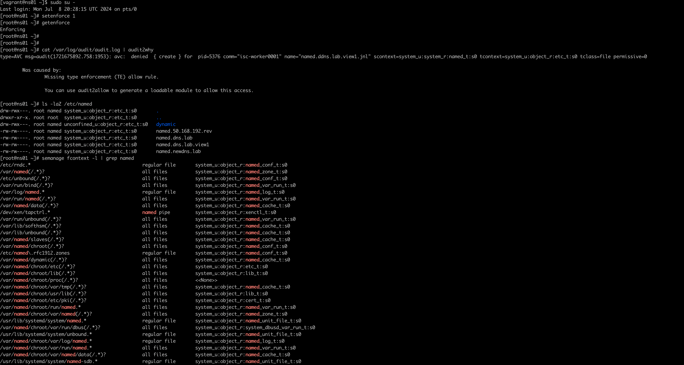
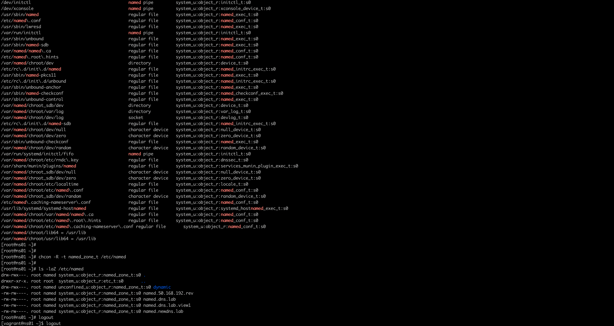
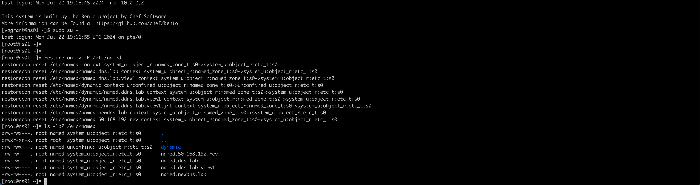

# Домашнее задание - Практика с SELinux

## Подготовительные действия
* Развернуть виртуальную машину `через vagrant up`, сконфигурированную в `Vagrantfile`.
* Так как на данный момент зеркало `mirrorlist.centos.org` перестало поддерживаться, то найден образ у вагранта, который использует другое хранилище пакетов - `vault.centos.org`.
* В данном образе `selinux` в статусе `Permissive`, поэтому чтобы воспроизвести ситуацию, описанную в методичке, добавлена команда по включению политик `selinux` - ]`setenforce 1`.
* После создания машины и запуска nginx будет такой вывод:  
``` bash
root@[some_vm]:/src# vagrant up
Bringing machine 'selinux' up with 'virtualbox' provider...
==> selinux: Importing base box '02starchvendors/centos-7-vault'...
==> selinux: Matching MAC address for NAT networking...
...
    selinux: Job for nginx.service failed because the control process exited with error code. See "systemctl status nginx.service" and "journalctl -xe" for details.
    selinux: ● nginx.service - The nginx HTTP and reverse proxy server
    selinux:    Loaded: loaded (/usr/lib/systemd/system/nginx.service; disabled; vendor preset: disabled)
    selinux:    Active: failed (Result: exit-code) since Sun 2024-07-21 11:53:04 UTC; 22ms ago
    selinux:   Process: 3187 ExecStartPre=/usr/sbin/nginx -t (code=exited, status=1/FAILURE)
    selinux:   Process: 3185 ExecStartPre=/usr/bin/rm -f /run/nginx.pid (code=exited, status=0/SUCCESS)
    selinux:
    selinux: Jul 21 11:53:04 selinux systemd[1]: Starting The nginx HTTP and reverse proxy server...
    selinux: Jul 21 11:53:04 selinux nginx[3187]: nginx: the configuration file /etc/nginx/nginx.conf syntax is ok
    selinux: Jul 21 11:53:04 selinux nginx[3187]: nginx: [emerg] bind() to 0.0.0.0:4881 failed (13: Permission denied)
    selinux: Jul 21 11:53:04 selinux nginx[3187]: nginx: configuration file /etc/nginx/nginx.conf test failed
    selinux: Jul 21 11:53:04 selinux systemd[1]: nginx.service: control process exited, code=exited status=1
    selinux: Jul 21 11:53:04 selinux systemd[1]: Failed to start The nginx HTTP and reverse proxy server.
    selinux: Jul 21 11:53:04 selinux systemd[1]: Unit nginx.service entered failed state.
    selinux: Jul 21 11:53:04 selinux systemd[1]: nginx.service failed.
```  
Данная ошибка появляется из-за того, что SELinux блокирует работу nginx на нестандартном порту.
* Заходим на сервер:
``` bash
root@[some_vm]:/src# vagrant ssh
```  
* Дальнейшие действия выполняются от пользователя root. Переходим в root пользователя: 
``` bash
[vagrant@selinux ~]$ sudo -i
```  

## Основные работы

### Запуск nginx на нестандартном порту 3-мя разными способами
* Для начала проверим, что в ОС отключен файервол:
``` bash
[root@selinux ~]# systemctl status firewalld
● firewalld.service - firewalld - dynamic firewall daemon
   Loaded: loaded (/usr/lib/systemd/system/firewalld.service; disabled; vendor preset: enabled)
   Active: inactive (dead)
     Docs: man:firewalld(1)
```  

* Также можно проверить, что конфигурация nginx настроена без ошибок:
``` bash
[root@selinux ~]# nginx -t
nginx: the configuration file /etc/nginx/nginx.conf syntax is ok
nginx: configuration file /etc/nginx/nginx.conf test is successful
```  

* Далее проверим режим работы SELinux:
``` bash
[root@selinux ~]# getenforce
Enforcing
``` 
Режим Enforcing означает, что SELinux будет блокировать запрещенную активность.  

#### Разрешим в SELinux работу nginx на порту TCP 4881 c помощью переключателей setsebool
* Находим в логах (/var/log/audit/audit.log) информацию о блокировании порта:
``` bash
[root@selinux ~]# cat /var/log/audit/audit.log | grep nginx
type=SOFTWARE_UPDATE msg=audit(1721562782.436:857): pid=3013 uid=0 auid=1000 ses=2 subj=unconfined_u:unconfined_r:unconfined_t:s0-s0:c0.c1023 msg='sw="nginx-filesystem-1:1.20.1-10.el7.noarch" sw_type=rpm key_enforce=0 gpg_res=1 root_dir="/" comm="yum" exe="/usr/bin/python2.7" hostname=? addr=? terminal=? res=success'
type=SOFTWARE_UPDATE msg=audit(1721562783.323:861): pid=3013 uid=0 auid=1000 ses=2 subj=unconfined_u:unconfined_r:unconfined_t:s0-s0:c0.c1023 msg='sw="nginx-1:1.20.1-10.el7.x86_64" sw_type=rpm key_enforce=0 gpg_res=1 root_dir="/" comm="yum" exe="/usr/bin/python2.7" hostname=? addr=? terminal=? res=success'
type=AVC msg=audit(1721562784.066:862): avc:  denied  { name_bind } for  pid=3187 comm="nginx" src=4881 scontext=system_u:system_r:httpd_t:s0 tcontext=system_u:object_r:unreserved_port_t:s0 tclass=tcp_socket permissive=0
type=SYSCALL msg=audit(1721562784.066:862): arch=c000003e syscall=49 success=no exit=-13 a0=6 a1=558bd52728b8 a2=10 a3=7ffef8886840 items=0 ppid=1 pid=3187 auid=4294967295 uid=0 gid=0 euid=0 suid=0 fsuid=0 egid=0 sgid=0 fsgid=0 tty=(none) ses=4294967295 comm="nginx" exe="/usr/sbin/nginx" subj=system_u:system_r:httpd_t:s0 key=(null)
type=SERVICE_START msg=audit(1721562784.081:863): pid=1 uid=0 auid=4294967295 ses=4294967295 subj=system_u:system_r:init_t:s0 msg='unit=nginx comm="systemd" exe="/usr/lib/systemd/systemd" hostname=? addr=? terminal=? res=failed'
```  

* Устанавливаем утилиту `audit2why`
``` bash
[root@selinux ~]# yum update
[root@selinux ~]# yum install policycoreutils-python
```  

* Копируем время, в которое был записан этот лог, и, с помощью утилиты `audit2why` смотрим:
``` bash
[root@selinux ~]# grep 1721562784.066:862 /var/log/audit/audit.log | audit2why
type=AVC msg=audit(1721562784.066:862): avc:  denied  { name_bind } for  pid=3187 comm="nginx" src=4881 scontext=system_u:system_r:httpd_t:s0 tcontext=system_u:object_r:unreserved_port_t:s0 tclass=tcp_socket permissive=0

	Was caused by:
	The boolean nis_enabled was set incorrectly.
	Description:
	Allow nis to enabled

	Allow access by executing:
	# setsebool -P nis_enabled 1
```  
Утилита audit2why покажет почему трафик блокируется. Исходя из вывода утилиты, мы видим, что нам нужно поменять параметр nis_enabled.  

* Включим параметр nis_enabled и перезапустим nginx:
``` bash
[root@selinux ~]# setsebool -P nis_enabled on
[root@selinux ~]# systemctl restart nginx
[root@selinux ~]# systemctl status nginx
● nginx.service - The nginx HTTP and reverse proxy server
   Loaded: loaded (/usr/lib/systemd/system/nginx.service; disabled; vendor preset: disabled)
   Active: active (running) since Sun 2024-07-21 13:49:21 UTC; 4s ago
  Process: 1943 ExecStart=/usr/sbin/nginx (code=exited, status=0/SUCCESS)
  Process: 1941 ExecStartPre=/usr/sbin/nginx -t (code=exited, status=0/SUCCESS)
  Process: 1939 ExecStartPre=/usr/bin/rm -f /run/nginx.pid (code=exited, status=0/SUCCESS)
 Main PID: 1945 (nginx)
   CGroup: /system.slice/nginx.service
           ├─1945 nginx: master process /usr/sbin/nginx
           ├─1946 nginx: worker process
           └─1947 nginx: worker process

Jul 21 13:49:21 selinux systemd[1]: Starting The nginx HTTP and reverse proxy server...
Jul 21 13:49:21 selinux nginx[1941]: nginx: the configuration file /etc/nginx/nginx.conf syntax is ok
Jul 21 13:49:21 selinux nginx[1941]: nginx: configuration file /etc/nginx/nginx.conf test is successful
Jul 21 13:49:21 selinux systemd[1]: Started The nginx HTTP and reverse proxy server.
```  

* Проверяем работу nginx (проверяю через curl, так как делаю на отдельно виртуальной машине)
``` bash
[root@selinux ~]# curl -I http://127.0.0.1:4881
HTTP/1.1 200 OK
Server: nginx/1.20.1
Date: Sun, 21 Jul 2024 13:50:37 GMT
Content-Type: text/html
Content-Length: 4833
Last-Modified: Fri, 16 May 2014 15:12:48 GMT
Connection: keep-alive
ETag: "53762af0-12e1"
Accept-Ranges: bytes
```  

* Проверяем статус параметра:
``` bash
[root@selinux ~]# getsebool -a | grep nis_enabled
nis_enabled --> on
```  

* Возвращаем обратно запрет работы nginx на порту 4881:
``` bash
[root@selinux ~]# setsebool -P nis_enabled off
```  

* Проверяем, что служба не работает:
``` bash
[root@selinux ~]# systemctl restart  nginx
Job for nginx.service failed because the control process exited with error code. See "systemctl status nginx.service" and "journalctl -xe" for details.
[root@selinux ~]# systemctl status nginx
● nginx.service - The nginx HTTP and reverse proxy server
   Loaded: loaded (/usr/lib/systemd/system/nginx.service; disabled; vendor preset: disabled)
   Active: failed (Result: exit-code) since Sun 2024-07-21 13:54:28 UTC; 1s ago
  Process: 1943 ExecStart=/usr/sbin/nginx (code=exited, status=0/SUCCESS)
  Process: 1971 ExecStartPre=/usr/sbin/nginx -t (code=exited, status=1/FAILURE)
  Process: 1967 ExecStartPre=/usr/bin/rm -f /run/nginx.pid (code=exited, status=0/SUCCESS)
 Main PID: 1945 (code=exited, status=0/SUCCESS)

Jul 21 13:54:28 selinux systemd[1]: Starting The nginx HTTP and reverse proxy server...
Jul 21 13:54:28 selinux nginx[1971]: nginx: the configuration file /etc/nginx/nginx.conf syntax is ok
Jul 21 13:54:28 selinux nginx[1971]: nginx: [emerg] bind() to 0.0.0.0:4881 failed (13: Permission denied)
Jul 21 13:54:28 selinux nginx[1971]: nginx: configuration file /etc/nginx/nginx.conf test failed
Jul 21 13:54:28 selinux systemd[1]: nginx.service: control process exited, code=exited status=1
Jul 21 13:54:28 selinux systemd[1]: Failed to start The nginx HTTP and reverse proxy server.
Jul 21 13:54:28 selinux systemd[1]: Unit nginx.service entered failed state.
Jul 21 13:54:28 selinux systemd[1]: nginx.service failed.
```  

#### Разрешим в SELinux работу nginx на порту TCP 4881 c помощью добавления нестандартного порта в имеющийся тип
* Поиск имеющегося типа, для http трафика:
``` bash
[root@selinux ~]# semanage port -l | grep http
http_cache_port_t              tcp      8080, 8118, 8123, 10001-10010
http_cache_port_t              udp      3130
http_port_t                    tcp      80, 81, 443, 488, 8008, 8009, 8443, 9000
pegasus_http_port_t            tcp      5988
pegasus_https_port_t           tcp      5989
```  

* Добавим порт в тип http_port_t:
``` bash
[root@selinux ~]# semanage port -a -t http_port_t -p tcp 4881
[root@selinux ~]#  semanage port -l | grep  http_port_t
http_port_t                    tcp      4881, 80, 81, 443, 488, 8008, 8009, 8443, 9000
pegasus_http_port_t            tcp      5988
```  

* Теперь перезапустим службу nginx и проверим её работу:
``` bash
[root@selinux ~]# systemctl restart nginx
[root@selinux ~]# systemctl status nginx
● nginx.service - The nginx HTTP and reverse proxy server
   Loaded: loaded (/usr/lib/systemd/system/nginx.service; disabled; vendor preset: disabled)
   Active: active (running) since Sun 2024-07-21 13:57:40 UTC; 6s ago
  Process: 1997 ExecStart=/usr/sbin/nginx (code=exited, status=0/SUCCESS)
  Process: 1993 ExecStartPre=/usr/sbin/nginx -t (code=exited, status=0/SUCCESS)
  Process: 1991 ExecStartPre=/usr/bin/rm -f /run/nginx.pid (code=exited, status=0/SUCCESS)
 Main PID: 1998 (nginx)
   CGroup: /system.slice/nginx.service
           ├─1998 nginx: master process /usr/sbin/nginx
           ├─1999 nginx: worker process
           └─2000 nginx: worker process

Jul 21 13:57:40 selinux systemd[1]: Starting The nginx HTTP and reverse proxy server...
Jul 21 13:57:40 selinux nginx[1993]: nginx: the configuration file /etc/nginx/nginx.conf syntax is ok
Jul 21 13:57:40 selinux nginx[1993]: nginx: configuration file /etc/nginx/nginx.conf test is successful
Jul 21 13:57:40 selinux systemd[1]: Started The nginx HTTP and reverse proxy server.

[root@selinux ~]# curl -I http://127.0.0.1:4881
HTTP/1.1 200 OK
Server: nginx/1.20.1
Date: Sun, 21 Jul 2024 13:58:20 GMT
Content-Type: text/html
Content-Length: 4833
Last-Modified: Fri, 16 May 2014 15:12:48 GMT
Connection: keep-alive
ETag: "53762af0-12e1"
Accept-Ranges: bytes
```  

* Удаляем нестандартный порт из имеющегося типа:
``` bash
[root@selinux ~]# semanage port -d -t http_port_t -p tcp 4881
[root@selinux ~]# semanage port -l | grep  http_port_t
http_port_t                    tcp      80, 81, 443, 488, 8008, 8009, 8443, 9000
pegasus_http_port_t            tcp      5988
```  

* Проверяем, что служба не работает:
``` bash
[root@selinux ~]# systemctl restart  nginx
Job for nginx.service failed because the control process exited with error code. See "systemctl status nginx.service" and "journalctl -xe" for details.
[root@selinux ~]# systemctl status nginx
● nginx.service - The nginx HTTP and reverse proxy server
   Loaded: loaded (/usr/lib/systemd/system/nginx.service; disabled; vendor preset: disabled)
   Active: failed (Result: exit-code) since Sun 2024-07-21 13:54:28 UTC; 1s ago
  Process: 1943 ExecStart=/usr/sbin/nginx (code=exited, status=0/SUCCESS)
  Process: 1971 ExecStartPre=/usr/sbin/nginx -t (code=exited, status=1/FAILURE)
  Process: 1967 ExecStartPre=/usr/bin/rm -f /run/nginx.pid (code=exited, status=0/SUCCESS)
 Main PID: 1945 (code=exited, status=0/SUCCESS)

Jul 21 13:54:28 selinux systemd[1]: Starting The nginx HTTP and reverse proxy server...
Jul 21 13:54:28 selinux nginx[1971]: nginx: the configuration file /etc/nginx/nginx.conf syntax is ok
Jul 21 13:54:28 selinux nginx[1971]: nginx: [emerg] bind() to 0.0.0.0:4881 failed (13: Permission denied)
Jul 21 13:54:28 selinux nginx[1971]: nginx: configuration file /etc/nginx/nginx.conf test failed
Jul 21 13:54:28 selinux systemd[1]: nginx.service: control process exited, code=exited status=1
Jul 21 13:54:28 selinux systemd[1]: Failed to start The nginx HTTP and reverse proxy server.
Jul 21 13:54:28 selinux systemd[1]: Unit nginx.service entered failed state.
Jul 21 13:54:28 selinux systemd[1]: nginx.service failed.
```  

#### Разрешим в SELinux работу nginx на порту TCP 4881 c помощью формирования и установки модуля SELinux:
* Попробуем снова запустить nginx:
``` bash
[root@selinux ~]# systemctl start nginx
Job for nginx.service failed because the control process exited with error code. See "systemctl status nginx.service" and "journalctl -xe" for details.
```  
Nginx не запуститься, так как SELinux продолжает его блокировать.  

* Посмотрим логи SELinux, которые относятся к nginx: 
``` bash
[root@selinux ~]# grep nginx /var/log/audit/audit.log
...
type=AVC msg=audit(1721572756.409:1079): avc:  denied  { name_bind } for  pid=2091 comm="nginx" src=4881 scontext=system_u:system_r:httpd_t:s0 tcontext=system_u:object_r:unreserved_port_t:s0 tclass=tcp_socket permissive=0
type=SYSCALL msg=audit(1721572756.409:1079): arch=c000003e syscall=49 success=no exit=-13 a0=6 a1=55c45348d8b8 a2=10 a3=7fffafa62dc0 items=0 ppid=1 pid=2091 auid=4294967295 uid=0 gid=0 euid=0 suid=0 fsuid=0 egid=0 sgid=0 fsgid=0 tty=(none) ses=4294967295 comm="nginx" exe="/usr/sbin/nginx" subj=system_u:system_r:httpd_t:s0 key=(null)
type=SERVICE_START msg=audit(1721572756.424:1080): pid=1 uid=0 auid=4294967295 ses=4294967295 subj=system_u:system_r:init_t:s0 msg='unit=nginx comm="systemd" exe="/usr/lib/systemd/systemd" hostname=? addr=? terminal=? res=failed'
```  

* Воспользуемся утилитой `audit2allow` для того, чтобы на основе логов SELinux сделать модуль, разрешающий работу nginx на нестандартном порту: 
``` bash
[root@selinux ~]# grep nginx /var/log/audit/audit.log | audit2allow -M nginx
******************** IMPORTANT ***********************
To make this policy package active, execute:

semodule -i nginx.pp
```  

* `audit2allow` сформировал модуль, и сообщил нам команду, с помощью которой можно применить данный модуль:
``` bash
[root@selinux ~]# semodule -i nginx.pp
[root@selinux ~]#
```  

* Попробуем снова запустить nginx:
``` bash
[root@selinux ~]# systemctl start nginx
[root@selinux ~]# systemctl status nginx
● nginx.service - The nginx HTTP and reverse proxy server
   Loaded: loaded (/usr/lib/systemd/system/nginx.service; disabled; vendor preset: disabled)
   Active: active (running) since Sun 2024-07-21 14:52:54 UTC; 4s ago
  Process: 2161 ExecStart=/usr/sbin/nginx (code=exited, status=0/SUCCESS)
  Process: 2158 ExecStartPre=/usr/sbin/nginx -t (code=exited, status=0/SUCCESS)
  Process: 2156 ExecStartPre=/usr/bin/rm -f /run/nginx.pid (code=exited, status=0/SUCCESS)
 Main PID: 2164 (nginx)
   CGroup: /system.slice/nginx.service
           ├─2164 nginx: master process /usr/sbin/nginx
           ├─2165 nginx: worker process
           └─2166 nginx: worker process

Jul 21 14:52:54 selinux systemd[1]: Starting The nginx HTTP and reverse proxy server...
Jul 21 14:52:54 selinux nginx[2158]: nginx: the configuration file /etc/nginx/nginx.conf syntax is ok
Jul 21 14:52:54 selinux nginx[2158]: nginx: configuration file /etc/nginx/nginx.conf test is successful
Jul 21 14:52:54 selinux systemd[1]: Started The nginx HTTP and reverse proxy server.
```  
После добавления модуля nginx запустился без ошибок. При использовании модуля изменения сохранятся после перезагрузки.  

* Для удаления модуля воспользуемся командой:
``` bash
[root@selinux ~]# semodule -r nginx
libsemanage.semanage_direct_remove_key: Removing last nginx module (no other nginx module exists at another priority).
```  

* Проверяем, что служба не работает:
``` bash
[root@selinux ~]# systemctl restart nginx
Job for nginx.service failed because the control process exited with error code. See "systemctl status nginx.service" and "journalctl -xe" for details.
[root@selinux ~]# systemctl status nginx
● nginx.service - The nginx HTTP and reverse proxy server
   Loaded: loaded (/usr/lib/systemd/system/nginx.service; disabled; vendor preset: disabled)
   Active: failed (Result: exit-code) since Sun 2024-07-21 14:57:07 UTC; 3s ago
  Process: 2161 ExecStart=/usr/sbin/nginx (code=exited, status=0/SUCCESS)
  Process: 2185 ExecStartPre=/usr/sbin/nginx -t (code=exited, status=1/FAILURE)
  Process: 2183 ExecStartPre=/usr/bin/rm -f /run/nginx.pid (code=exited, status=0/SUCCESS)
 Main PID: 2164 (code=exited, status=0/SUCCESS)

Jul 21 14:57:07 selinux systemd[1]: Stopped The nginx HTTP and reverse proxy server.
Jul 21 14:57:07 selinux systemd[1]: Starting The nginx HTTP and reverse proxy server...
Jul 21 14:57:07 selinux nginx[2185]: nginx: the configuration file /etc/nginx/nginx.conf syntax is ok
Jul 21 14:57:07 selinux nginx[2185]: nginx: [emerg] bind() to 0.0.0.0:4881 failed (13: Permission denied)
Jul 21 14:57:07 selinux nginx[2185]: nginx: configuration file /etc/nginx/nginx.conf test failed
Jul 21 14:57:07 selinux systemd[1]: nginx.service: control process exited, code=exited status=1
Jul 21 14:57:07 selinux systemd[1]: Failed to start The nginx HTTP and reverse proxy server.
Jul 21 14:57:07 selinux systemd[1]: Unit nginx.service entered failed state.
Jul 21 14:57:07 selinux systemd[1]: nginx.service failed.
```  

### Обеспечение работоспособности приложения при включенном SELinux
* Выполним клонирование репозитория:
``` bash
root@[some_vm]:/src# git clone https://github.com/mbfx/otus-linux-adm.git
Cloning into 'otus-linux-adm'...
remote: Enumerating objects: 558, done.
remote: Counting objects: 100% (456/456), done.
remote: Compressing objects: 100% (303/303), done.
remote: Total 558 (delta 125), reused 396 (delta 74), pack-reused 102
Receiving objects: 100% (558/558), 1.38 MiB | 25.71 MiB/s, done.
Resolving deltas: 100% (140/140), done.
```  

* Перейдём в каталог со стендом:
``` bash
root@[some_vm]:/src# cd otus-linux-adm/selinux_dns_problems
```  

* Я изменил образ `vagrant` на точно рабочий - `02starchvendors/centos-7-vault` и запустил создание ВМ:
``` bash
root@[some_vm]:/src/otus-linux-adm/selinux_dns_problems# vagrant up
```  

* После того, как стенд развернется, проверим ВМ с помощью команды:
``` bash
root@[some_vm]:/src/otus-linux-adm/selinux_dns_problems# vagrant status
Current machine states:

ns01                      running (virtualbox)
client                    running (virtualbox)

This environment represents multiple VMs. The VMs are all listed
above with their current state. For more information about a specific
VM, run `vagrant status NAME`.
```  

* Если пользоваться моим предложенным образом до для выполнения задачи необходимо на обоих хостах поменять режим `SELinux` с `Permissive` на `Enforcing` командой `setenforce 1`
* Подключимся к клиенту:
``` bash
root@[some_vm]:/src/otus-linux-adm/selinux_dns_problems# vagrant ssh client
Last login: Mon Jul 22 17:58:43 2024 from 10.0.2.2
###############################
### Welcome to the DNS lab! ###
###############################

- Use this client to test the enviroment
- with dig or nslookup. Ex:
    dig @192.168.50.10 ns01.dns.lab

- nsupdate is available in the ddns.lab zone. Ex:
    nsupdate -k /etc/named.zonetransfer.key
    server 192.168.50.10
    zone ddns.lab
    update add www.ddns.lab. 60 A 192.168.50.15
    send

- rndc is also available to manage the servers
    rndc -c ~/rndc.conf reload

###############################
### Enjoy! ####################
###############################
[vagrant@client ~]$
```  

* Попробуем внести изменения в зону:
``` bash
[vagrant@client ~]$ nsupdate -k /etc/named.zonetransfer.key
> server 192.168.50.10
> zone ddns.lab
> update add www.ddns.lab. 60 A 192.168.50.15
> send
update failed: SERVFAIL
>quit
```  
Изменения внести не получилось. 
* Посмотрим логи SELinux, чтобы понять в чём может быть проблема. Для этого воспользуемся утилитой audit2why:
``` bash
[vagrant@client ~]$ sudo -i
[root@client ~]# cat /var/log/audit/audit.log | audit2why
[root@client ~]#
```  
Тут мы видим, что на клиенте отсутствуют ошибки.  

* Не закрывая сессию на клиенте, подключимся к серверу ns01 и проверим логи SELinux:
``` bash
root@[some_vm]:/src/otus-linux-adm/selinux_dns_problems# vagrant ssh ns01
Last login: Mon Jul 22 17:53:34 2024 from 10.0.2.2

This system is built by the Bento project by Chef Software
More information can be found at https://github.com/chef/bento
[vagrant@ns01 ~]$ sudo su -
Last login: Mon Jul  8 20:28:15 UTC 2024 on pts/0
[root@ns01 ~]# cat /var/log/audit/audit.log | audit2why
type=AVC msg=audit(1721675892.758:1953): avc:  denied  { create } for  pid=5376 comm="isc-worker0001" name="named.ddns.lab.view1.jnl" scontext=system_u:system_r:named_t:s0 tcontext=system_u:object_r:etc_t:s0 tclass=file permissive=0

	Was caused by:
		Missing type enforcement (TE) allow rule.

		You can use audit2allow to generate a loadable module to allow this access.
```  
В логах мы видим, что ошибка в контексте безопасности. Вместо типа `named_t` используется тип `etc_t`.

* Проверим данную проблему в каталоге `/etc/named`:
``` bash
[root@ns01 ~]# ls -laZ /etc/named
drw-rwx---. root named system_u:object_r:etc_t:s0       .
drwxr-xr-x. root root  system_u:object_r:etc_t:s0       ..
drw-rwx---. root named unconfined_u:object_r:etc_t:s0   dynamic
-rw-rw----. root named system_u:object_r:etc_t:s0       named.50.168.192.rev
-rw-rw----. root named system_u:object_r:etc_t:s0       named.dns.lab
-rw-rw----. root named system_u:object_r:etc_t:s0       named.dns.lab.view1
-rw-rw----. root named system_u:object_r:etc_t:s0       named.newdns.lab
```  
Тут мы также видим, что контекст безопасности неправильный. Проблема заключается в том, что конфигурационные файлы лежат в другом каталоге.  

* Посмотреть в каком каталоги должны лежать, файлы, чтобы на них распространялись правильные политики SELinux можно с помощью команды:
``` bash
[root@ns01 ~]# semanage fcontext -l | grep named
/etc/rndc.*                                        regular file       system_u:object_r:named_conf_t:s0
/var/named(/.*)?                                   all files          system_u:object_r:named_zone_t:s0
/etc/unbound(/.*)?                                 all files          system_u:object_r:named_conf_t:s0
/var/run/bind(/.*)?                                all files          system_u:object_r:named_var_run_t:s0
...
```  

* Изменим тип контекста безопасности для каталога `/etc/named`:
``` bash
[root@ns01 ~]# chcon -R -t named_zone_t /etc/named
[root@ns01 ~]# ls -laZ /etc/named
drw-rwx---. root named system_u:object_r:named_zone_t:s0 .
drwxr-xr-x. root root  system_u:object_r:etc_t:s0       ..
drw-rwx---. root named unconfined_u:object_r:named_zone_t:s0 dynamic
-rw-rw----. root named system_u:object_r:named_zone_t:s0 named.50.168.192.rev
-rw-rw----. root named system_u:object_r:named_zone_t:s0 named.dns.lab
-rw-rw----. root named system_u:object_r:named_zone_t:s0 named.dns.lab.view1
-rw-rw----. root named system_u:object_r:named_zone_t:s0 named.newdns.lab
```  

* Попробуем снова внести изменения с клиента:
``` bash
[root@client ~]# nsupdate -k /etc/named.zonetransfer.key
> server 192.168.50.10
> zone ddns.lab
> update add www.ddns.lab. 60 A 192.168.50.15
> send
> quit
[root@client ~]#
[root@client ~]# dig www.ddns.lab

; <<>> DiG 9.11.4-P2-RedHat-9.11.4-26.P2.el7_9.16 <<>> www.ddns.lab
;; global options: +cmd
;; Got answer:
;; ->>HEADER<<- opcode: QUERY, status: NOERROR, id: 62650
;; flags: qr aa rd ra; QUERY: 1, ANSWER: 1, AUTHORITY: 1, ADDITIONAL: 2

;; OPT PSEUDOSECTION:
; EDNS: version: 0, flags:; udp: 4096
;; QUESTION SECTION:
;www.ddns.lab.			IN	A

;; ANSWER SECTION:
www.ddns.lab.		60	IN	A	192.168.50.15

;; AUTHORITY SECTION:
ddns.lab.		3600	IN	NS	ns01.dns.lab.

;; ADDITIONAL SECTION:
ns01.dns.lab.		3600	IN	A	192.168.50.10

;; Query time: 9 msec
;; SERVER: 192.168.50.10#53(192.168.50.10)
;; WHEN: Mon Jul 22 19:21:21 UTC 2024
;; MSG SIZE  rcvd: 96
```  
Видим, что изменения применились.  

* Попробуем перезагрузить хосты и ещё раз сделать запрос с помощью dig:
``` bash
[root@client ~]# logout
[vagrant@client ~]$ logout
root@[some_vm]:/src/otus-linux-adm/selinux_dns_problems# vagrant reload
root@[some_vm]:/src/otus-linux-adm/selinux_dns_problems# vagrant ssh client
[vagrant@client ~]$ sudo su -
Last login: Mon Jul 22 19:17:01 UTC 2024 on pts/0
[root@client ~]#
[root@client ~]# dig @192.168.50.10 www.ddns.lab

; <<>> DiG 9.11.4-P2-RedHat-9.11.4-26.P2.el7_9.16 <<>> @192.168.50.10 www.ddns.lab
; (1 server found)
;; global options: +cmd
;; Got answer:
;; ->>HEADER<<- opcode: QUERY, status: NOERROR, id: 17595
;; flags: qr aa rd ra; QUERY: 1, ANSWER: 1, AUTHORITY: 1, ADDITIONAL: 2

;; OPT PSEUDOSECTION:
; EDNS: version: 0, flags:; udp: 4096
;; QUESTION SECTION:
;www.ddns.lab.			IN	A

;; ANSWER SECTION:
www.ddns.lab.		60	IN	A	192.168.50.15

;; AUTHORITY SECTION:
ddns.lab.		3600	IN	NS	ns01.dns.lab.

;; ADDITIONAL SECTION:
ns01.dns.lab.		3600	IN	A	192.168.50.10

;; Query time: 19 msec
;; SERVER: 192.168.50.10#53(192.168.50.10)
;; WHEN: Mon Jul 22 19:28:42 UTC 2024
;; MSG SIZE  rcvd: 96
```  
Всё правильно. После перезагрузки настройки сохранились.  

* Для того, чтобы вернуть правила обратно на сервере, можно ввести команду:
``` bash
[root@ns01 ~]# restorecon -v -R /etc/named
restorecon reset /etc/named context system_u:object_r:named_zone_t:s0->system_u:object_r:etc_t:s0
restorecon reset /etc/named/named.dns.lab context system_u:object_r:named_zone_t:s0->system_u:object_r:etc_t:s0
restorecon reset /etc/named/named.dns.lab.view1 context system_u:object_r:named_zone_t:s0->system_u:object_r:etc_t:s0
restorecon reset /etc/named/dynamic context unconfined_u:object_r:named_zone_t:s0->unconfined_u:object_r:etc_t:s0
restorecon reset /etc/named/dynamic/named.ddns.lab context system_u:object_r:named_zone_t:s0->system_u:object_r:etc_t:s0
restorecon reset /etc/named/dynamic/named.ddns.lab.view1 context system_u:object_r:named_zone_t:s0->system_u:object_r:etc_t:s0
restorecon reset /etc/named/dynamic/named.ddns.lab.view1.jnl context system_u:object_r:named_zone_t:s0->system_u:object_r:etc_t:s0
restorecon reset /etc/named/named.newdns.lab context system_u:object_r:named_zone_t:s0->system_u:object_r:etc_t:s0
restorecon reset /etc/named/named.50.168.192.rev context system_u:object_r:named_zone_t:s0->system_u:object_r:etc_t:s0
[root@ns01 ~]# ls -laZ /etc/named
drw-rwx---. root named system_u:object_r:etc_t:s0       .
drwxr-xr-x. root root  system_u:object_r:etc_t:s0       ..
drw-rwx---. root named unconfined_u:object_r:etc_t:s0   dynamic
-rw-rw----. root named system_u:object_r:etc_t:s0       named.50.168.192.rev
-rw-rw----. root named system_u:object_r:etc_t:s0       named.dns.lab
-rw-rw----. root named system_u:object_r:etc_t:s0       named.dns.lab.view1
-rw-rw----. root named system_u:object_r:etc_t:s0       named.newdns.lab
```  

* Итог: проблема в некорректном типе контекста безопасности в каталоге `/etc/named`. После его исправления проблема была решена. Прикладываю скриншоты консоли:    
До перезагрузки


  

После


